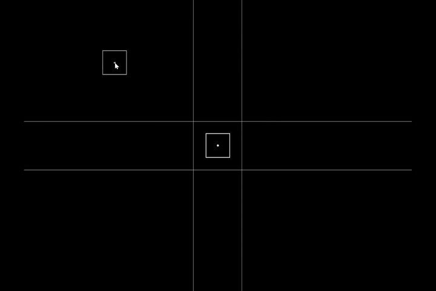

# Swept AABB Collision Detection

A simple demo of swept AABB collision detection.

Inspired by and loosely based on [Dylan Falconer's Engine From Scratch Episode 08](https://www.youtube.com/watch?v=3dIiTo7mlnU) video
([Source code](https://github.com/Falconerd/engine-from-scratch)).

I also referenced the [Swept AABB Collision Detection and Response](https://www.gamedev.net/tutorials/programming/general-and-gameplay-programming/swept-aabb-collision-detection-and-response-r3084/)
article, but as it stands now, this demo doesn't implement any sort of deflection or sliding. Maybe I will do it later though.

## Usage

Requires the [Odin](https://odin-lang.org/) compiler. Im using the version `dev-2024-07-nightly:b4ca044`

Clone/dowload the source code:
```bash
git clone https://github.com/ethanavatar/swept_aabb_collisions.git
```

And use `odin run` in the source directory to run the demo:
```bash
# Change directory
cd swept_aabb_collisions

# Run the demo
odin run . --
```


